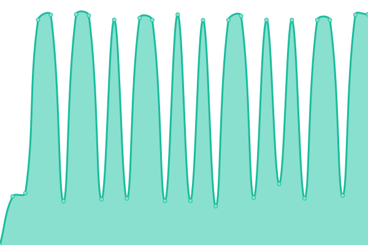
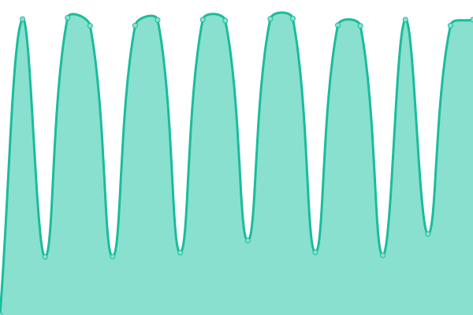
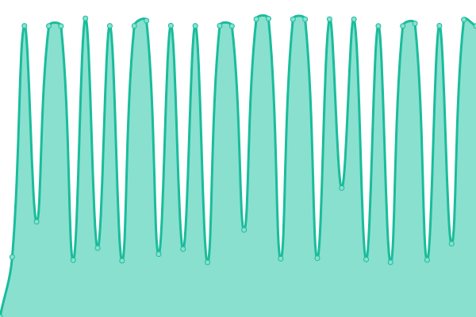
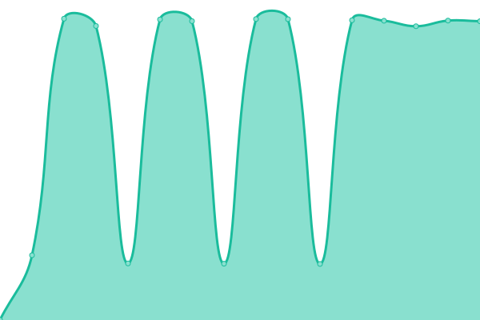

# [📈 Live Status](https://Eotel.github.io/pxe-yokohama-rpi-uptime): <!--live status--> **🟩 All systems operational**

This repository contains the open-source uptime monitor and status page for [Eotel](https://Eotel.github.io/pxe-yokohama-rpi-uptime), powered by [Upptime](https://github.com/upptime/upptime).

With [Upptime](https://upptime.js.org), you can get your own unlimited and free uptime monitor and status page, powered entirely by a GitHub repository. We use [Issues](https://github.com/Eotel/pxe-yokohama-rpi-uptime/issues) as incident reports, [Actions](https://github.com/Eotel/pxe-yokohama-rpi-uptime/actions) as uptime monitors, and [Pages](https://Eotel.github.io/pxe-yokohama-rpi-uptime) for the status page.

<!--start: status pages-->
<!-- This summary is generated by Upptime (https://github.com/upptime/upptime) -->
<!-- Do not edit this manually, your changes will be overwritten -->
<!-- prettier-ignore -->
| URL | Status | History | Response Time | Uptime |
| --- | ------ | ------- | ------------- | ------ |
|  RPi3B+ 01 | 🟩 Up | [r-pi3-b-01.yml](https://github.com/Eotel/pxe-yokohama-rpi-uptime/commits/HEAD/history/r-pi3-b-01.yml) | 

 2152ms
     
 | 

<a href="https://Eotel.github.io/pxe-yokohama-rpi-uptime/history/r-pi3-b-01">22.82%</a>
    

|  RPi3B+ 02 | 🟩 Up | [r-pi3-b-02.yml](https://github.com/Eotel/pxe-yokohama-rpi-uptime/commits/HEAD/history/r-pi3-b-02.yml) | 

 1714ms
     
 | 

<a href="https://Eotel.github.io/pxe-yokohama-rpi-uptime/history/r-pi3-b-02">22.73%</a>
    

|  RPi3B+ 03 | 🟩 Up | [r-pi3-b-03.yml](https://github.com/Eotel/pxe-yokohama-rpi-uptime/commits/HEAD/history/r-pi3-b-03.yml) | 

 1704ms
     
 | 

<a href="https://Eotel.github.io/pxe-yokohama-rpi-uptime/history/r-pi3-b-03">22.74%</a>
    

|  RPi3B+ 04 | 🟩 Up | [r-pi3-b-04.yml](https://github.com/Eotel/pxe-yokohama-rpi-uptime/commits/HEAD/history/r-pi3-b-04.yml) | 

 1743ms
     
 | 

<a href="https://Eotel.github.io/pxe-yokohama-rpi-uptime/history/r-pi3-b-04">22.90%</a>
    

|  RPi3B+ 05 | 🟩 Up | [r-pi3-b-05.yml](https://github.com/Eotel/pxe-yokohama-rpi-uptime/commits/HEAD/history/r-pi3-b-05.yml) | 

 1671ms
     
 | 

<a href="https://Eotel.github.io/pxe-yokohama-rpi-uptime/history/r-pi3-b-05">22.83%</a>
    

|  RPi3B+ 06 | 🟩 Up | [r-pi3-b-06.yml](https://github.com/Eotel/pxe-yokohama-rpi-uptime/commits/HEAD/history/r-pi3-b-06.yml) | 

 1697ms
     
 | 

<a href="https://Eotel.github.io/pxe-yokohama-rpi-uptime/history/r-pi3-b-06">22.91%</a>
    

|  RPi3B+ 07 | 🟩 Up | [r-pi3-b-07.yml](https://github.com/Eotel/pxe-yokohama-rpi-uptime/commits/HEAD/history/r-pi3-b-07.yml) | 

 1719ms
     
 | 

<a href="https://Eotel.github.io/pxe-yokohama-rpi-uptime/history/r-pi3-b-07">22.84%</a>
    

|  RPi3B+ 08 | 🟩 Up | [r-pi3-b-08.yml](https://github.com/Eotel/pxe-yokohama-rpi-uptime/commits/HEAD/history/r-pi3-b-08.yml) | 

 1677ms
     
 | 

<a href="https://Eotel.github.io/pxe-yokohama-rpi-uptime/history/r-pi3-b-08">22.84%</a>
    

<!--end: status pages-->

[**Visit our status website →**](https://Eotel.github.io/pxe-yokohama-rpi-uptime)

## 📄 License

- Powered by: [Upptime](https://github.com/upptime/upptime)
- Code: [MIT](./LICENSE) © [Eotel](https://Eotel.github.io/pxe-yokohama-rpi-uptime)
- Data in the `./history` directory: [Open Database License](https://opendatacommons.org/licenses/odbl/1-0/)
